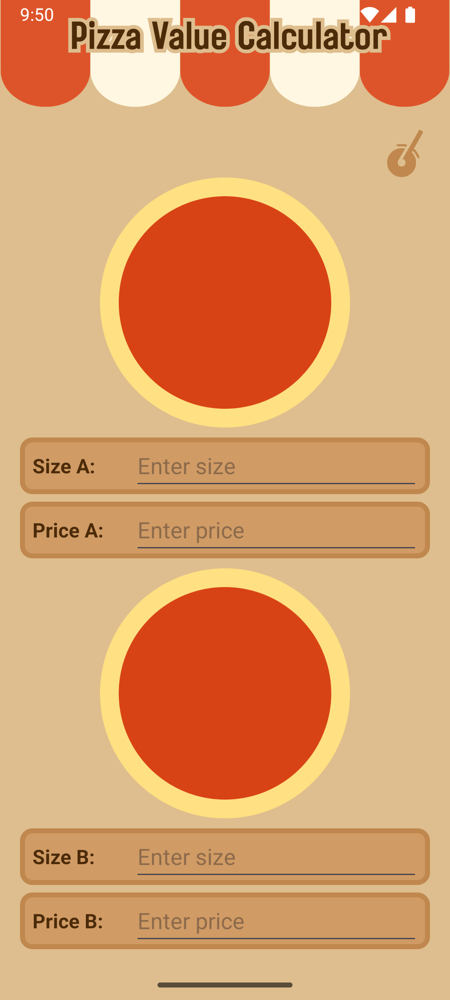
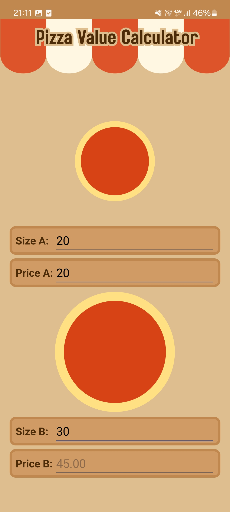
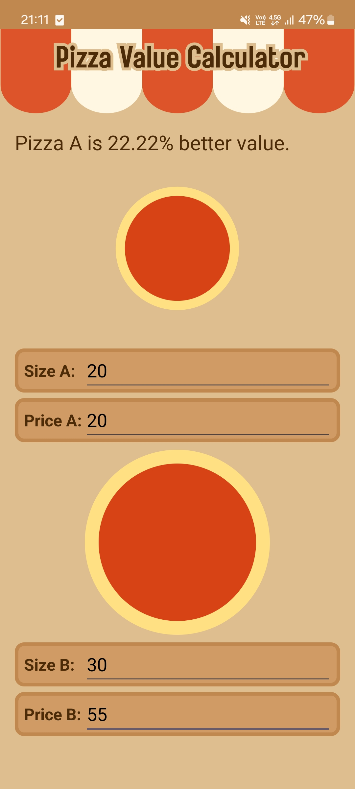

<picture>
  <source srcset="Images/HeaderDark.png" media="(prefers-color-scheme: dark)" />
  
</picture> 

Welcome! Have you ever wondered if you're getting your money's worth from your pizza while choosing between different sizes? This app offers an intuitive and quick way to compare different pizza sizes and prices to calculate which option gives you the most value.

## Contents
* [`AndroidApp`](AndroidApp) contains all the necessary project files for the Android application
* [`Images`](Images) includes screenshots and other media of the app
* [`LICENSE`](LICENSE.txt) entails the properties of this projects license
* [`Releases`](https://github.com/OzzyBozy/PizzaValueCalculator/releases) contains the files for downloading the app

---

**Pizza Value Calculator** allows users to input the following for two pizzas:

- Pizza sizes (in diameter or radius)
- Pizza prices
- (Optionally) Fractional sizes for more advanced comparisons

The app then calculates and compares price-per-area values for each pizza, showing you exactly which one delivers more pizza per money with percentages. It also visually scales the pizzas to show their size difference.

### Example:

<table>
<tr>
<td width="25%">Empty UI</td>
<td width="25%">UI with 3 inputs, suggesting the 4th</td>
<td width="25%">UI with complete data, comparing the value</td>
</tr>
<tr>
<td>
<picture>
  <source srcset="Images/EmptyUIDark.jpg" media="(prefers-color-scheme: dark)" />
  
</picture> 
</td>
<td>
 <picture>
  <source srcset="Images/EstimationExampleDark.jpg" media="(prefers-color-scheme: dark)" />
  
</picture> 
</td>
<td>
<picture>
  <source srcset="Images/ValueComparisonDark.jpg" media="(prefers-color-scheme: dark)" />
  
</picture>  
</td>
</tr>
</table>

---

## How to Build

| Build in Android Studio | Download APK for Android |
| --- | --- |
| Clone the repository: `git clone https://github.com/OzzyBozy/PizzaValueCalculator.git` | Download the `PVC-0.1.0-alpha.apk` file from the [Releases](https://github.com/OzzyBozy/PizzaValueCalculator/releases) page. |
| Open the project in **Android Studio**. | Transfer or download the APK to your Android device via the link. |
| Let Gradle sync and resolve dependencies automatically. | Ensure that your device allows installation from unknown sources (Settings → Security → Unknown sources). |
| Click ▶️ to build and run either on your device or emulator. | Open the APK file to install the app. |

Done! Now you have either set up the project in Android Studio or installed the APK directly on your device.

---

## Contributing
Currently, this is a **single-developer-maintained project**.  
You are welcome to:

- Submit issues
- Suggest features
- Discuss bugs
- Develop the app for other platforms

Direct commits to `main` are restricted so use Pull Requests if you wish to suggest change.

---

## License

The code is **open source** — but with important restrictions:

 ✅ You may use, modify, and redistribute the code for non-commercial purposes.  
 ✅ Proper credit to the author ("OzzyBozy") is always required.  
 ❌ **Commercial use is prohibited** unless written permission is granted.  
 ❌ Unauthorized monetization, repackaging, or selling is strictly forbidden.  

The full license text is available here: [LICENSE.txt](LICENSE.txt).

---
*Thank you for checking out Pizza Value Calculator.  
May your slices always be large, round, and fairly priced.*
